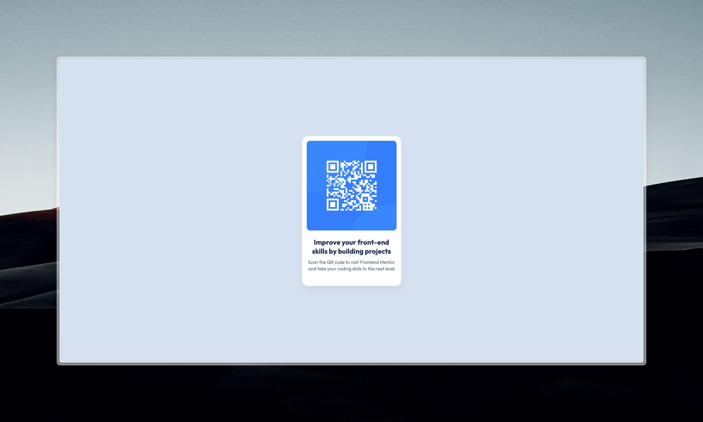

# Frontend Mentor - QR code component solution

This is a solution to the [QR code component challenge on Frontend Mentor](https://www.frontendmentor.io/challenges/qr-code-component-iux_sIO_H). Frontend Mentor challenges help you improve your coding skills by building realistic projects. 

## Table of contents

- [Overview](#overview)
  - [Screenshot](#screenshot)
  - [Links](#links)
- [My process](#my-process)
  - [Built with](#built-with)
  - [What I learned](#what-i-learned)
  - [Continued development](#continued-development)
  - [Useful resources](#useful-resources)
- [Author](#author)
- [Acknowledgments](#acknowledgments)

## Overview

### Screenshot



### Links

- Live Site URL: [qr-code-component-beryl-eight.vercel.app](qr-code-component-beryl-eight.vercel.app)

## My process

### Built with

- HTML5 - Markup structure
- CSS3 - Styling and layout
- Google Fonts
- Flexbox - Centering and alignment

### What I learned

During this challenge, I improved my understanding of layout, responsiveness, and clean design. Here are a few key things that I've learned:

**1. Centering with Flexbox**  
I used Flexbox to center the card in the middle of the screen both vertically and horizontally
```css
body {
  display: flex;
  justify-content: center;
  align-items: center;
  height: 100vh;
}
```
**2. Responsive Units**  
Instead of fixed *px* values, I used *rem* and *%* to keep the layout responsive
```css
.card {
  padding: 1rem 1rem 3rem;
  max-width: 320px;
  width: 100%;
}
```
**3. Using CSS Variables for Theming**  
I used custom properties for colors to keep my CSS clean and maintainable
```css
:root {
    --White: hsl(0, 0%, 100%);
    --Slate-300: hsl(212, 45%, 89%);
    --Slate-500: hsl(216, 15%, 48%);
    --Slate-900: hsl(218, 44%, 22%);
}
```

### Continued development

In future projects I plan to focus on responsiveness of my layouts. I was always doing mobile dev where it's not so important and need to work on it a little. Additionally, I aim to further refine and perfect the overall styling to make the code cleaner and easier to maintain. These improvements will help enhance both visual appeal and development as the projects evolve.
